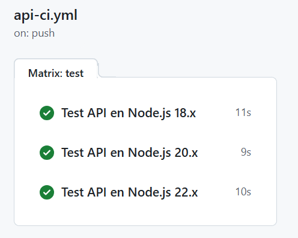
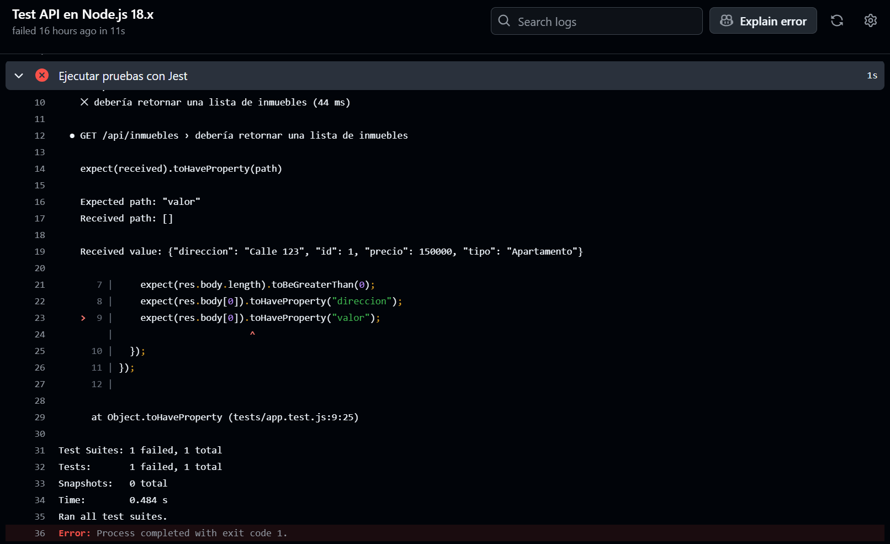

# RealEstate API

API REST básica que simula un sistema inmobiliario, desarrollada con **Node.js** y **Express**, y validada mediante pruebas automatizadas con **Jest** y **GitHub Actions**.

## 📌 Objetivos del proyecto

- Crear una API simple que devuelva una lista de inmuebles.
- Escribir pruebas automatizadas con Jest.
- Automatizar la validación usando GitHub Actions.
- Ejecutar pruebas en múltiples versiones de Node.js.
- Optimizar tiempos usando caché de dependencias.
- Ejecutar tareas condicionales según éxito o fallo.

## 🚀 Tecnologías usadas

- Node.js
- Express
- Jest
- GitHub Actions


## 📁 Estructura del proyecto
```
realestate-api/
├── .github/
│ └── workflows/
│ └── api-ci.yml # Workflow de CI
├── src/
│ └── app.js # Código de la API
├── tests/
│ └── app.test.js # Pruebas automatizadas
├── package.json
└── package-lock.json
```

## 🧪 Pruebas automatizadas

El archivo `app.test.js` contiene pruebas para validar que el endpoint `/api/inmuebles`:

- Retorna un código de estado 200.
- Devuelve una lista no vacía.
- Contiene campos como `direccion` y `precio`.

Ejecutar localmente con:

```bash
npm test
```
## ⚙️ GitHub Actions CI
Se automatizó la ejecución de pruebas en GitHub con:

- Estrategia de matrices para Node 18.x, 20.x y 22.x.
- Caché de dependencias npm para mejorar tiempos.
- Mensajes condicionales según resultado (✅/❌).
- **Archivo del workflow:** .github/workflows/api-ci.yml
Verifica automáticamente cada push o pull request en la rama main.

## ✅ Validación en múltiples entornos
Gracias al uso de una matriz en el workflow de GitHub Actions, las pruebas se ejecutan automáticamente en distintas versiones de Node.js (18.x, 20.x, 22.x), garantizando compatibilidad y estabilidad.

✔️ Ejecución exitosa  


Todas las pruebas pasaron correctamente en los tres entornos definidos. Esto demuestra que la API funciona de forma consistente sin importar la versión del entorno Node.js.

## ❌ Demo de fallo intencional
Para demostrar que GitHub Actions detecta automáticamente errores, se simula una falla modificando intencionalmente una de las pruebas.

🔁 Modificación del test
Se cambia el nombre de la propiedad esperada de precio a valor en el archivo app.test.js:

```diff
- expect(res.body[0]).toHaveProperty("precio");
+ expect(res.body[0]).toHaveProperty("valor");
```
💥 Resultado en el workflow
Al hacer commit de ese cambio, GitHub Actions ejecuta las pruebas y detecta el fallo:



La prueba falla correctamente, demostrando que el sistema de CI detecta automáticamente los errores antes de que lleguen a producción.

## 📌 Preguntas Finales
**1. ¿Qué importancia tiene probar en múltiples entornos de Node.js?**  
Probar en varias versiones permite asegurar que la API funciona correctamente sin importar qué versión esté usando el entorno de ejecución. Esto es clave para compatibilidad y mantenibilidad del código.

**2. ¿Por qué es importante validar la salida de una API desde un workflow?**  
Porque automatiza la verificación de que los endpoints funcionen correctamente. Esto evita errores en producción y garantiza que los cambios no rompan funcionalidades existentes.

**3. ¿Qué pasos podrías agregar si fueras a hacer despliegue a producción?**  
- Agregar etapas de build y deploy
- Validaciones de seguridad (OWASP Dependency-Check, Trivy).
- Pruebas de integración y cobertura.
- Notificación por Slack/Discord en caso de fallos.

**4. ¿Qué limitaciones tiene GitHub Actions y cómo las enfrentarías?**  
- **Tiempo limitado en el plan gratuito.**  
 **Solución:** optimizar con caché o usar runners propios.
- **Limitado a GitHub.**  
 **Solución:** combinar con otras herramientas CI/CD si se necesita mayor integración.
- **Complejidad en workflows grandes.**  
 **Solución:** modularizar workflows y usar plantillas reutilizables (reusable workflows).
